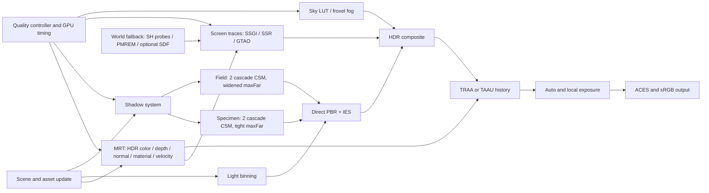

# Unreal Engine 조명 기술의 오픈소스 WebGPU 렌더러 적용 검토

기준일: 2026-07-17
적용 후보: Floraxis / Three.js 0.185.1 / `WebGPURenderer` + TSL
검토 범위: 실시간 사실적 조명, 그림자, 간접광, 반사, 대기·볼류메트릭, 노출, 시간축 복원, 브라우저 배포

## 1. 결론

Unreal Engine의 조명 기술을 WebGPU에 **부분 적용하는 것은 충분히 타당**하지만, Lumen·Virtual Shadow Maps·MegaLights를 동일 구조와 품질로 복제하는 것은 현재의 표준 WebGPU와 브라우저 실행 조건에서는 타당하지 않다.

권장 결론은 다음과 같다.

1. 즉시 적용할 기술
   - 물리 단위 기반 광원, IES, 선형 HDR·PBR·PMREM IBL
   - 화면공간 GI/반사와 신뢰도 기반 IBL 폴백
   - 필드 모드용 2단 CSM, 안정화된 섀도, 제한적 PCSS/SMRT 유사 필터
   - 모션 벡터 기반 TRAA, 시간축 필터, 동적 렌더 해상도
   - 히스토그램 자동 노출, ACES, 선택적 로컬 노출
   - LUT 기반 물리 하늘과 저해상도 froxel 대기 원근

2. 조건부 프로토타입
   - 월드 공간 SH 광원 프로브/라디언스 캐시
   - 정적 메시용 오프라인 SDF와 제한된 SDF ray march
   - 클러스터드 라이트 컬링 및 수십~수백 광원용 확장
   - 저해상도 볼류메트릭 포그

3. 현재 제품에는 보류할 기술
   - Lumen Surface Cache와 카드 시스템 전체
   - 완전한 Virtual Shadow Map 페이지 시스템
   - 하드웨어 RT 기반 MegaLights/ReSTIR 가시성
   - 브라우저용 실시간 전체 장면 path tracing

Floraxis에는 현재 세 개의 주요 직접광만 있으므로 MegaLights류의 many-light 최적화는 이득이 거의 없다. 착수 시점에는 필드 모드의 단일 2K 방향광 섀도, 시간축 누적의 부재, 임의 단위 조명, 화면공간 효과의 폴백 합성이 바로 개선할 문제였다.

2026-07-17 우선 구현에서 velocity MRT+TRAA, SSGI 시간축 계약, 2단 CSM, SSR 에너지 보정, GPU/프레임 시간 기반 적응형 품질, 실제 WebGL 2 폴백을 적용했다. 물리 광량·IES, 분리된 IBL specular 버퍼, SH probe 폴백은 다음 단계다.

## 2. 핵심 판단 근거

### 2.1 Unreal이 효율을 얻는 공통 원리

Unreal의 개별 기능보다 중요한 것은 반복해서 사용되는 다음 설계 원리다.

- 가장 싼 표현부터 조회한다: 화면공간 → 캐시/프록시 → 실제 지오메트리 추적.
- 모든 픽셀과 모든 광원을 매 프레임 완전 계산하지 않는다: 중요도 샘플링, 타일 분류, 업데이트 예산, 시간축 재사용.
- 고해상도 데이터는 실제로 보이는 부분만 만든다: VSM 페이지, Surface Cache 타일, clipmap.
- 저해상도 노이즈를 공간·시간 필터로 복원한다.
- 내부 해상도를 낮추고 모션 벡터와 히스토리로 출력 해상도를 복원한다.
- 정적·저주파 성분은 lightmap, probe, LUT, PMREM에 미리 저장한다.
- 품질 경로를 단일 기술로 고정하지 않고 장면과 하드웨어에 따라 계층화한다.

이 원리는 WebGPU에도 그대로 유효하다. 단, Unreal의 소스 코드를 복사하는 것이 아니라 공개 문서와 논문을 근거로 독립 구현해야 한다.

### 2.2 WebGPU의 현재 경계

2026-07-14 WebGPU 편집자 초안의 공식 기능 목록에는 compute, storage resource, timestamp query, `shader-f16`, subgroups 등이 있지만 **표준 하드웨어 ray tracing, sparse texture residency, bindless descriptor, 명시적 async-compute queue는 없다**. 이는 [WebGPU Feature Index](https://gpuweb.github.io/gpuweb/#feature-index)에 열거된 표준 기능을 기준으로 한 판단이다.

따라서 다음과 같이 해석해야 한다.

- WGSL compute에서 자체 BVH를 순회하는 software ray tracing은 가능하다.
- 브라우저가 DXR/Vulkan RT/Metal RT를 지원하더라도 WebGPU 표준 API로 가속 구조와 ray query를 직접 사용할 수는 없다.
- VSM은 하드웨어 sparse texture 대신 수동 page table + 고정 크기 texture-array/atlas로 흉내 내야 한다.
- Unreal의 async compute와 같은 큐 배치 제어를 애플리케이션이 직접 재현할 수 없다.
- subgroups 등 선택 기능은 반드시 feature detection과 비선택 경로를 가져야 한다.

WebGPU 자체의 배포 범위는 확대되었지만 브라우저·OS별 지원 시점과 기능 차이가 남아 있다. 현재 상태는 [GPUWeb Implementation Status](https://github.com/gpuweb/gpuweb/wiki/Implementation-Status)에서 확인해야 한다.

### 2.3 라이선스 경계

Unreal Engine은 소스 접근이 가능한 상용 라이선스 제품이지 MIT/BSD식 오픈소스가 아니다. Epic은 Unreal 코드를 다른 엔진에 복사하면 그 제품이 Unreal EULA의 적용을 받는다고 명시한다. 따라서 MIT인 Floraxis/Three.js 쪽에는 Unreal 엔진 코드를 옮기지 말고 공개 논문·슬라이드·문서에서 설명된 아이디어를 clean-room 방식으로 구현해야 한다. 자세한 경계는 [Unreal Engine on GitHub FAQ](https://www.unrealengine.com/ue-on-github?lang=en-US)와 [현재 EULA](https://www.unrealengine.com/eula/unreal)를 기준으로 별도 검토해야 한다. 이 문서는 법률 자문이 아니다.

## 3. Unreal 조명 기술 분석

### 3.1 PBR, 물리 광량, IES, IBL

Unreal은 재질을 물리 기반 파라미터로 제한하고 광원을 lux, candela, lumen, cd/m², EV100 같은 측정 가능한 단위로 다룬다. IES 프로파일은 실제 조명기구의 각도별 배광을 매우 낮은 비용의 texture lookup으로 재현한다.

효율의 원천은 고가의 광선 추적이 아니라 입력 데이터의 일관성이다. 에너지 보존 BRDF, 올바른 감쇠, HDR 환경맵과 prefiltered specular IBL만 제대로 맞아도 장면의 사실감과 조명 조정 가능성이 크게 올라간다.

근거:

- [Unreal Physical Lighting Units](https://dev.epicgames.com/documentation/en-us/unreal-engine/using-physical-lighting-units-in-unreal-engine)
- [Unreal Physically Based Materials](https://dev.epicgames.com/documentation/en-us/unreal-engine/physically-based-materials-in-unreal-engine)
- [Unreal IES Light Profiles](https://dev.epicgames.com/documentation/unreal-engine/using-ies-light-profiles-in-unreal-engine)

### 3.2 Lumen: 계층형 동적 GI와 반사

Lumen은 하나의 ray-tracing 방법이 아니라 여러 표현을 결합한 계층형 시스템이다.

- 화면에 이미 있는 지오메트리는 Screen Traces로 먼저 처리한다.
- software path는 개별 Mesh Distance Field와 Global Distance Field를 추적한다.
- hardware path는 triangle acceleration structure를 사용한다.
- ray hit의 조명은 고가의 hit shading 대신 다방향 material capture인 Surface Cache에서 조회할 수 있다.
- Surface Cache는 기본적으로 메시당 제한된 수의 Cards를 오프라인 생성하며, 직접·간접광 업데이트를 여러 프레임에 분산한다.
- 먼 간접광은 world-space radiance cache와 screen probes로 재사용한다.
- 거울 반사처럼 정확도가 중요한 경우에만 더 비싼 경로를 선택한다.

Epic의 공개 설명상 Lumen의 콘솔 목표는 내부 1080p에서 GI와 반사에 약 8 ms를 쓰고 TSR로 출력 해상도를 복원하는 구조다. 이 수치는 브라우저 목표값이 아니라, Lumen이 시간축 복원과 낮은 내부 해상도 없이는 성립하지 않는다는 참고치다.

근거:

- [Lumen Technical Details](https://dev.epicgames.com/documentation/en-us/unreal-engine/lumen-technical-details-in-unreal-engine)
- [Lumen Performance Guide](https://dev.epicgames.com/documentation/en-us/unreal-engine/lumen-performance-guide-for-unreal-engine)
- [Lumen: Real-time Global Illumination in Unreal Engine 5, SIGGRAPH 2022](https://advances.realtimerendering.com/s2022/SIGGRAPH2022-Advances-Lumen-Wright%20et%20al.pdf)

### 3.3 Virtual Shadow Maps와 SMRT

VSM은 각 광원에 논리적으로 16K shadow map을 제공하지만, 실제로는 화면에 필요한 페이지를 물리 페이지 풀에 할당하고 이전 프레임의 페이지를 재사용한다. 방향광은 카메라 중심 clipmap을 사용하고, 각 레벨이 두 배 넓은 범위를 덮는다.

Soft shadow는 실제 지오메트리 ray intersection 대신 shadow map을 따라 여러 지점을 샘플하는 Shadow Map Ray Tracing으로 근사한다. 비용은 페이지 생성과 화면상의 shadow projection으로 나뉘며, 움직이는 지오메트리와 WPO는 캐시를 자주 무효화한다.

근거: [Virtual Shadow Maps](https://dev.epicgames.com/documentation/en-us/unreal-engine/virtual-shadow-maps-in-unreal-engine)

### 3.4 MegaLights: stochastic direct lighting

MegaLights는 각 픽셀에 영향을 주는 모든 광원을 완전히 계산하지 않고 중요 광원을 선택해 고정 개수의 ray를 쏜다. 따라서 비용은 광원 수와 함께 선형 증가하는 대신 대체로 고정되고, 한 픽셀에 겹치는 광원이 너무 많으면 비용보다 품질과 노이즈가 먼저 나빠진다. 하드웨어 RT가 권장되며 VSM 가시성도 선택할 수 있다.

이 설계는 ReSTIR와 같은 reservoir 기반 many-light 연구와 방향이 유사하지만, 공개 문서만으로 MegaLights 내부를 임의로 ReSTIR라고 동일시해서는 안 된다. WebGPU에서 many-light 샘플 재사용을 구현할 때의 독립적인 참고로는 [ReSTIR 원 논문](https://research.nvidia.com/index.php/publication/2020-07_spatiotemporal-reservoir-resampling-real-time-ray-tracing-dynamic-direct)을 사용할 수 있다.

근거:

- [MegaLights in Unreal Engine](https://dev.epicgames.com/documentation/unreal-engine/megalights-in-unreal-engine)
- [MegaLights: Stochastic Direct Lighting, SIGGRAPH 2025](https://advances.realtimerendering.com/s2025/content/MegaLights_Stochastic_Direct_Lighting_2025.pdf)

### 3.5 TSR: 낮은 내부 해상도를 가능하게 하는 핵심 기술

TSR은 단순한 업스케일 필터가 아니다.

- jittered low-resolution input
- 깊이와 모션 벡터 기반 history reprojection
- disocclusion 판정
- 현재 shading과 history의 일치 여부를 평가하는 rejection/clamping
- 고주파 깜빡임 안정화
- 선택적 고해상도 history
- 동적 해상도

를 함께 사용한다. Unreal의 사실적 조명 성능은 TSR로 절약한 픽셀 비용을 Lumen과 shadow에 다시 배분하기 때문에 가능하다.

근거: [Temporal Super Resolution](https://dev.epicgames.com/documentation/unreal-engine/temporal-super-resolution-in-unreal-engine)

### 3.6 Lightmass와 Volumetric Lightmaps

정적 또는 제한적으로 변하는 장면에서는 실시간 GI보다 bake가 훨씬 높은 품질/비용 효율을 낸다. Lightmass는 surface lightmap에 복잡한 간접광을 저장하고, Volumetric Lightmaps는 공간상의 조명 샘플을 SH로 저장해 동적 오브젝트와 fog가 보간한다.

이 경로는 “항상 완전 동적”이어야 하지 않은 웹 전시·제품 시각화·건축 장면에서 특히 타당하다.

근거:

- [GPU Lightmass](https://dev.epicgames.com/documentation/en-us/unreal-engine/gpu-lightmass-global-illumination-in-unreal-engine)
- [Volumetric Lightmaps](https://dev.epicgames.com/documentation/en-us/unreal-engine/volumetric-lightmaps-in-unreal-engine)

### 3.7 Sky Atmosphere와 Volumetric Fog

Unreal의 물리 하늘은 Rayleigh/Mie scattering을 매 픽셀 고샘플 ray march하지 않고 Transmittance, Multiple Scattering, Sky View, Aerial Perspective LUT로 나눈다. Aerial Perspective는 camera-frustum froxel에 저장한다.

Volumetric Fog도 저해상도 frustum-aligned volume을 만들고 프레임마다 sub-voxel jitter를 바꾸어 무거운 temporal reprojection으로 노이즈를 감춘다. 품질 비용은 주로 XY 해상도와 Z slice 수에 의해 결정된다.

근거:

- [Sky Atmosphere](https://dev.epicgames.com/documentation/en-us/unreal-engine/sky-atmosphere-component-in-unreal-engine)
- [Hillaire 2020: A Scalable and Production Ready Sky and Atmosphere Rendering Technique](https://doi.org/10.1111/cgf.14050)
- [Volumetric Fog](https://dev.epicgames.com/documentation/unreal-engine/volumetric-fog-in-unreal-engine)

### 3.8 Auto Exposure, Local Exposure, ACES

사실적인 HDR 광량은 디스플레이에 바로 표시할 수 없으므로 노출과 tone mapping이 필수다. Unreal은 64-bin histogram 기반 metering, EV100, eye adaptation, base/detail 분해를 이용한 local exposure, ACES 계열 filmic tone mapping을 사용한다.

근거:

- [Auto Exposure and Local Exposure](https://dev.epicgames.com/documentation/en-us/unreal-engine/auto-exposure-in-unreal-engine)
- [Filmic Tonemapper](https://dev.epicgames.com/documentation/en-us/unreal-engine/color-grading-and-filmic-tonemapper?application_version=4.27)

## 4. 기술별 WebGPU 적용 타당성

난이도는 숙련된 그래픽스 엔지니어가 기존 렌더러에 통합한다고 가정한 상대 평가다. “동등도”는 Unreal 결과와의 기능적 동등성이지 픽셀 단위 일치를 뜻하지 않는다.

| 기술 | WebGPU 구현 방법 | 동등도 | 난이도 | Floraxis 판단 |
| --- | --- | --- | --- | --- |
| PBR + HDR + PMREM IBL | 기존 Three NodeMaterial와 half-float HDR 유지, 색공간/재질 범위 검증 | 높음 | 낮음 | 유지·교정 |
| 물리 광량·IES | meter 단위 고정, cd/lm/lux 변환 계층, `IESSpotLight`/`IESLoader` | 높음 | 낮음 | 즉시 적용 가치 높음 |
| ACES + 자동 노출 | luminance downsample 또는 compute histogram, percentile metering, EV adaptation | 높음 | 중간 | 권장 |
| Local Exposure | bilateral/base-detail 또는 multi-exposure fusion을 half/quarter resolution으로 계산 | 중~높음 | 중~높음 | cinematic만 |
| SSR + IBL fallback | SSR hit confidence로 PMREM specular를 대체/혼합 | 중간 | 낮~중간 | 에너지 보정 적용, specular 분리는 남음 |
| SSGI | 현재 SSGI 유지, TRAA 또는 별도 denoise, off-screen은 probe fallback | 중간 | 중간 | TRAA 정합 완료, probe는 남음 |
| Lumen radiance cache 유사 | camera-relative SH probe clipmap, 일부 probe만 매 프레임 업데이트 | 중간 | 높음 | 2차 프로토타입 |
| Lumen SDF tracing 유사 | 정적 메시 SDF를 오프라인 생성, 3D texture/clipmap ray march | 중간 | 매우 높음 | 얇고 변형되는 꽃에는 부적합 |
| Lumen Surface Cache 전체 | mesh cards, material atlas, tile lighting, invalidation budget | 중간 | 매우 높음 | 보류 |
| CSM | `CSMShadowNode`, stable split, cascade별 해상도/갱신률 | 높음 | 중간 | 2단 적용 완료 |
| SMRT/PCSS 유사 soft shadow | blocker search + blue-noise/Poisson shadow samples + temporal denoise | 중간 | 중~높음 | 제한적 적용 |
| Virtual Shadow Maps 전체 | 수동 page table + physical texture-array atlas + feedback/caching | 중간 | 매우 높음 | 현재 규모에는 비타당 |
| Batched/clustered lights | Three `DynamicLighting` 후 compute tile/cluster light list로 확장 | 높음 | 중~높음 | 광원이 늘 때만 |
| MegaLights/ReSTIR 유사 | reservoir candidate/temporal/spatial reuse + 별도 visibility backend | 낮~중간 | 매우 높음 | 현재 3광원에는 비타당 |
| TRAA | velocity MRT + jitter + history rejection, MSAA 비활성 | 높음(AA) | 중간 | 적용 완료 |
| TSR급 TAAU | TRAA 위에 저해상도 render target, display-resolution history, reactive mask | 중간 | 높음 | 2단계 |
| Baked lightmap/SH probe | 외부 baker 또는 progressive GPU bake, glTF 확장/별도 asset | 높음 | 중간 | 정적 장면에 매우 타당 |
| 물리 하늘 LUT | transmittance/multi-scatter/sky-view 2D LUT + aerial 3D LUT | 높음 | 중~높음 | 야외 모드에 권장 |
| Froxel fog | 저해상도 3D storage texture, clustered light injection, temporal reprojection | 중~높음 | 높음 | 선택 기능 |
| 표준 HW ray tracing | 현재 WebGPU Feature Index에 API 없음 | 없음 | 해당 없음 | 보류 |

## 5. 권장 WebGPU 조명 아키텍처

핵심은 각 화면공간 효과가 “성공하면 더하는 옵션”이 아니라, 실패 영역을 명시적으로 다음 표현에 넘기는 계층이 되는 것이다.

- 반사: SSR hit → local reflection probe/PMREM → sky.
- 간접광: SSGI hit → SH radiance probe → environment irradiance.
- shadow: near CSM → far low-frequency/cached shadow → contact AO.
- 해상도: dynamic internal resolution → temporal reconstruction → spatial fallback.

## 6. Floraxis 현재 구현 진단

### 6.1 이미 갖춘 기반

`src/render/bloom-renderer.ts` 기준으로 다음은 이미 구현되어 있다.

- `WebGPURenderer`와 TSL `RenderPipeline`
- HDR 출력과 ACES filmic tone mapping
- PMREM 기반 environment lighting과 사용자 HDR panorama
- PBR NodeMaterial, petal/leaf SSS
- 32-byte 한도 내 4-attachment MRT: output, diffuseMetal, normalRough, velocity + depth
- SSGI, SSR, GTAO, screen-space contact shadow
- bloom, shaped DOF, TRAA
- practical split과 fade를 쓰는 2단 CSM
- instancing과 LOD
- reduced/balanced/cinematic adaptive quality tier

Three.js의 TSL은 MRT, compute, storage, `traa`, `denoise`, SSGI, SSR, GTAO를 같은 노드 파이프라인에서 구성할 수 있다. 근거: [TSL Specification](https://threejs.org/docs/TSL.html)과 [WebGPURenderer 문서](https://threejs.org/docs/pages/WebGPURenderer.html).

### 6.2 착수 시 즉시 수정할 구조적 문제

> 이 절은 수정 전 상태의 진단 기록이다. 적용 결과는 6.3에 정리한다.

1. SSGI temporal contract 불일치

   로컬 Three.js 0.185.1의 `SSGINode`는 `useTemporalFiltering = true`가 기본이며 TRAA 사용을 요구한다. 현재 Floraxis의 최종 AA는 `smaa(composite)`이다. 따라서 현재 SSGI의 frame-varying sampling은 충분히 누적되지 않는다.

   해결:

   - MRT에 `velocity`를 추가한다.
   - `WebGPURenderer({ antialias: false })`로 MSAA를 끈다.
   - 최종 composite를 `traa(composite, depth, velocity, camera)`에 넣는다.
   - TRAA 도입 전 임시 경로에서는 `giPass.useTemporalFiltering = false`로 만들고 `DenoiseNode`를 사용한다.

2. 필드 모드 shadow texel density 붕괴

   단일 2048² 방향광 shadow camera의 범위를 필드 반경에 맞춰 넓히므로 필드가 커질수록 꽃잎과 줄기의 contact shadow 해상도가 급격히 낮아진다.

   해결:

   - specimen은 현재의 타이트한 2K shadow를 유지한다.
   - field는 `CSMShadowNode` 2~3 cascade와 practical split을 사용한다.
   - cascade projection을 shadow texel에 snap해 카메라 이동 shimmer를 막는다.
   - 가장 먼 cascade에서는 작은 꽃잎/잔풀의 shadow caster를 생략하거나 단순화한다.
   - 바람이 강한 far LOD는 shadow용 움직임을 정지시키거나 낮은 빈도로 갱신한다.

3. 화면공간 반사의 에너지 중복 가능성

   현재 pipeline은 이미 IBL이 포함된 scene color에 SSR 결과를 단순 가산한다. 재질과 SSR node의 반환 의미에 따라 specular energy가 중복될 수 있다.

   해결:

   - SSR hit/confidence, edge fade, roughness를 명시적 mask로 만든다.
   - 가능한 경우 IBL specular 성분을 `mix(iblSpecular, ssrSpecular, confidence)`로 대체한다.
   - 분리된 specular buffer가 어렵다면 SSR intensity를 물리 보정값이 아닌 화면 효과임을 명확히 하고 white-furnace test로 에너지 증가를 제한한다.

4. 물리 광량 불일치

   Three의 `PointLight.intensity`는 cd이고 기본 decay 2는 inverse-square 감쇠다. 현재 fill/rim은 9 cd와 8 cd, environment와 directional intensity는 별도의 임의 scale이다. 화면은 만들 수 있지만 실제 광량 preset을 재사용하거나 노출을 예측하기 어렵다.

   해결:

   - 1 unit = 1 m를 고정한다.
   - point/spot은 cd 또는 `power` lm로 입력한다.
   - directional은 프로젝트 내부의 lux-to-radiance calibration 계층을 둔다.
   - 환경맵은 절대 휘도 또는 명시적 calibration metadata를 가진다.
   - artistic multiplier는 물리 입력과 별도 필드로 분리한다.

5. GPU 비용을 보지 않는 quality controller

   현재 측정은 FPS, draw call, triangle 수이며 GPU pass timing과 p95 frame time이 없다. 픽셀 비율도 balanced 1.25, cinematic 1.6의 고정 cap이다.

   해결:

   - `timestamp-query`를 optional feature로 탐지하고 가능한 backend에서 pass별 GPU 시간을 기록한다.
   - 지원되지 않으면 CPU submit-to-frame의 완만한 추정값으로 폴백한다.
   - 0.7~1.25 범위에서 internal scale을 천천히 조절하고 camera cut 시 history를 reset한다.
   - 조절 순서는 SSR/SSGI scale → sample 수 → render scale → shadow cascade 순으로 한다.

6. 하늘과 fog는 물리 모델이 아님

   현재 1024×512 canvas panorama와 `FogExp2`는 비용이 낮고 미술적으로 유용하지만 sun/sky/atmospheric transmittance가 연결되지 않는다.

   해결:

   - 야외 preset만 물리 Sky LUT 경로를 추가한다.
   - sun 방향이 충분히 바뀌었을 때만 PMREM 또는 저차 SH 환경광을 갱신한다.
   - fog는 우선 depth 기반 aerial perspective, 이후 선택적으로 froxel volume으로 확장한다.

7. WebGL fallback 계약이 실제 초기화와 다름

   Three의 `WebGPURenderer`는 WebGPU가 없으면 WebGL 2 backend를 선택할 수 있지만, 현재 Floraxis는 초기화 전에 `WebGPU.isAvailable()`이 false이면 예외를 던진다. 따라서 UI의 `WebGL 2 fallback` 표시는 현재 흐름에서는 사실상 도달할 수 없다.

   해결:

   - WebGPU 전용 제품이면 fallback 표시와 분기를 제거하고 최소 지원 조건을 명확히 한다.
   - 넓은 배포가 목적이면 renderer의 backend 선택을 허용하고 compute·SSGI·3D storage texture 기능을 개별 capability로 강등한다.
   - Three.js 0.185.1을 고정하고 업그레이드 때마다 주요 조명 장면의 이미지 회귀 테스트를 수행한다. `WebGPURenderer`와 TSL API는 아직 변화 속도가 빠르다.

### 6.3 2026-07-17 우선 구현 결과

구현 위치는 [bloom-renderer.ts](../src/render/bloom-renderer.ts)와 [adaptive-quality.ts](../src/render/adaptive-quality.ts)다.

1. **SSGI + TRAA 계약 완료**

   - 기본 MSAA와 SMAA를 제거하고 최종 composite를 `traa(composite, depth, velocity, camera)`로 resolve한다.
   - MRT에 Three의 `velocity` node를 추가하고 `SSGINode.useTemporalFiltering = true`를 명시했다.
   - 카메라 jitter, 이전 instance matrix, depth/velocity history rejection은 Three r185의 `TRAANode` 경로를 사용한다.
   - WebGPU 기본 `maxColorAttachmentBytesPerSample = 32`에서 5개 MRT가 검증 실패한 실제 문제가 발견됐다. `diffuse.rgb + metalness.a`, `packedNormal.rgb + roughness.a`로 패킹해 `output / diffuseMetal / normalRough / velocity` 4개 attachment로 줄였다. 특정 GPU의 높은 device limit를 강제하지 않아 이식성을 유지한다.

2. **단일 섀도를 2단 CSM으로 교체**

   - `CSMShadowNode`의 practical split, cascade fade, texel snapping을 사용한다.
   - 장면 크기에 따라 `maxFar`와 light margin을 재적합한다.
   - reduced/balanced/cinematic tier의 cascade map은 각각 512²/1024²/2048²다.
   - 초기 3단안은 기본 120개 꽃밭에서 섀도 재렌더 비용이 과했다. 2단으로 줄여 근거리/원거리 분포 이점은 유지하면서 비용을 낮췄다.

3. **SSR 합성을 에너지 인지형으로 변경**

   - 식물의 비금속 표면은 r185 SSR early-out을 사용하고 금속/광택 표면만 추적한다.
   - SSR alpha의 hit distance, metalness, roughness로 replacement mask를 만들고, hit 영역에서 기존 IBL 포함 scene color의 glossy share를 일부 감쇠한 뒤 SSR을 합성한다.
   - 이는 분리된 specular lighting buffer가 없는 현재 구조에서의 보수적 근사다. 정확한 `mix(iblSpecular, ssrSpecular, confidence)`와 white-furnace 검증은 남아 있다.

4. **적응형 품질과 실측 telemetry 추가**

   - `trackTimestamp`와 `resolveTimestampsAsync(RENDER)`를 사용하며 15프레임마다 query pool을 비운다.
   - GPU 시간이 JS scene update나 instance upload 비용을 충분히 나타내지 못할 수 있어 실제 FPS 기반 frame time과 GPU time 중 큰 값을 controller 입력으로 사용한다.
   - sustained overload 2회 후 한 단계 강등하고, cooldown 뒤 안정 샘플 8회가 있어야 복구한다. 셰이더 최초 컴파일·장면 생성 뒤에는 1.5~3초 warm-up grace를 둔다.
   - tier는 pixel ratio, GTAO 해상도/샘플, SSR/접촉 그림자 해상도, SSGI slice/step, CSM map size를 함께 조절한다.

5. **WebGL 2 폴백 계약을 실제로 검증**

   - 사전 `WebGPU.isAvailable()` 예외를 제거해 `WebGPURenderer`의 backend 선택을 허용했다.
   - `?backend=webgl` 진단 경로로 폴백을 강제할 수 있다.
   - Three.js r185 SSR은 WebGL GLSL 생성 시 `max(int, float)` 컴파일 오류가 발생해 폴백 capability에서 비활성화한다. SSGI도 요구 feature가 없으면 비활성화한다.
   - 나머지 CSM, TRAA, GTAO, 접촉 그림자, bloom 파이프라인은 WebGL 2에서 정상 기동했다.

6. **검증 결과**

   아래 값은 Codex in-app Browser의 1280×720 관찰값이며 표준화된 p95 benchmark가 아니다.

   | 경로 | 장면/품질 | 관찰 결과 |
   | --- | --- | --- |
   | WebGPU | 120개 기본 꽃밭 / balanced / 3 cascade 실험 | 273 draws, 5,203,137 triangles, 29 FPS 관찰 |
   | WebGPU | 같은 꽃밭 / balanced / 최종 2 cascade | 212 draws, 3,909,323 triangles, 60 FPS 관찰 |
   | WebGPU | 같은 꽃밭 / cinematic | 212 draws, 3,909,323 triangles, 60 FPS 관찰 |
   | WebGL 2 fallback | 단일 장미 / balanced | 200 draws, 128,674 triangles, 60 FPS, SSGI·SSR 강등 |

   전체 TypeScript 검사, 19개 테스트 파일의 78개 테스트, production build가 통과했다. 최종 WebGPU balanced/cinematic와 WebGL 2 폴백에서 브라우저 콘솔 오류·경고는 0건이었다.

7. **제품 경로를 재사용하는 Lighting QA Lab 추가**

   - `/lighting-test.html`은 `BloomRenderer.setDiagnosticScene()`으로 기준 장면을 주입하므로 CSM, MRT, SSGI, SSR, GTAO, 접촉 그림자, TRAA, 적응형 품질이 본 앱과 동일한 코드 경로를 지난다.
   - 재질 에너지, 장거리 CSM/얇은 형상, 시간 안정성의 세 장면과 Production/Baseline/GI/Reflection A/B 프로필을 제공한다.
   - 1초 워밍업 뒤 5초 동안 median, p95, p99 기반 1% low와 평균 GPU timestamp를 계산한다.
   - 1280×720 WebGPU balanced/production 시간 안정성 장면의 301프레임 측정은 평균 60.0 FPS, median 16.6ms, p95 17.2ms, 1% low 57.5 FPS로 PASS였다.
   - WebGL 2 강제 폴백과 390×844 모바일 레이아웃도 확인했다. 세부 절차와 자동·육안 판정 경계는 [Lighting QA 테스트 앱 가이드](./lighting-qa-test-app-ko.md)에 기록했다.

## 7. 세부 적용 방법

### 7.1 1단계: 측정 가능한 물리 조명 기반

- 월드 스케일을 meter로 문서화하고 camera near/far, light range, fog distance를 함께 교정한다.
- baseColor/emissive는 sRGB 입력, normal/roughness/metalness/data texture는 linear로 검증한다.
- HDR intermediate는 half-float를 유지하고 tone mapping 전에 clamp하지 않는다.
- 18% gray card, chrome sphere, rough dielectric sphere, white furnace 장면을 추가한다.
- IES 파일은 `IESLoader`와 WebGPU 전용 `IESSpotLight`로 불러온다.
- point/spot cutoff는 성능 culling용임을 표시하고, 시각적 pop이 없는 smooth falloff를 유지한다.

### 7.2 2단계: 시간축 기반 파이프라인

MRT에 velocity를 추가하고 최종 AA를 TRAA로 전환한다. Three r185에는 `velocity` node와 `TRAANode`가 이미 있다.

검토해야 할 항목:

- camera jitter 전/후 projection matrix 관리
- instance matrix의 이전 프레임 데이터
- procedural wind의 이전 위치
- bloom progress가 급변할 때 history rejection
- 얇은 꽃잎의 disocclusion과 SSS 변화
- environment 교체, camera reset, mode 변경 시 history reset
- translucent/alpha-tested foliage의 velocity 정책

TRAA가 안정화된 뒤에만 저해상도 render target과 display-resolution history를 분리해 TAAU를 만든다. 처음부터 TSR 전체를 재현하려고 하면 디버깅 범위가 너무 커진다.

### 7.3 3단계: shadow 계층화

현재 구현:

- specimen/field 공통 2 cascade CSM
- practical split, cascade fade, texel snapping
- 장면 bounds에 따른 `maxFar`와 light margin 재적합
- reduced/balanced/cinematic별 512²/1024²/2048² map
- PCF soft shadow와 normal bias calibration

다음 최적화 후보:

- 원거리 cascade의 shadow caster LOD
- 바람이 강한 far LOD의 shadow 움직임 저주파 갱신
- 정적 지형/지지대 shadow cache

Soft shadow:

- light angular radius로 penumbra 목표를 정한다.
- shadow depth에서 소수 blocker sample을 찾는다.
- penumbra 크기에 따라 4~12개의 blue-noise/Poisson sample을 사용한다.
- 낮은 샘플 수는 TRAA로 누적하되 fast motion에서 sample 수 또는 sharp fallback을 올린다.

### 7.4 4단계: Lumen-lite 간접광

현재 SSGI와 PMREM 사이에 world-space SH probe를 추가한다.

권장 시작점:

- field bounds를 덮는 8×4×8 또는 12×6×12 probe grid
- RGB SH L1 또는 L2
- probe마다 irradiance와 visibility moment 저장
- camera/lighting 변화 시 전체가 아니라 5~10%씩 갱신
- current SSGI가 off-screen hit를 잃을 때 probe를 사용
- 벽/지면 뒤의 light leak를 depth moment와 normal bias로 억제

동적 probe update에 정확한 ray visibility가 필요해지면 다음 중 하나를 택한다.

- 정적 terrain/rock만 포함한 저해상도 SDF
- CPU에서 빌드한 BVH를 storage buffer에 올리고 WGSL compute로 순회
- rasterized cubemap/hemicube probe update

Floraxis의 얇고 양면이며 계속 변형되는 꽃잎을 고해상도 SDF에 매 프레임 반영하는 것은 비타당하다. 꽃은 screen-space 기여와 저주파 proxy/capsule 정도로 제한한다.

DDGI 설계의 독립 구현 참고는 [RTXGI DDGI algorithm notes](https://github.com/NVIDIAGameWorks/RTXGI-DDGI/blob/main/docs/Algorithms.md)를 사용할 수 있다. 해당 구현의 라이선스는 도입 전에 별도 확인한다.

### 7.5 5단계: 많은 광원이 실제 요구일 때만 확장

광원 수가 자주 변하는 수준에서는 Three r185의 [DynamicLighting](https://threejs.org/docs/pages/DynamicLighting.html)이 point light 64개 등의 batched uniform 경로를 제공한다. 이는 shader recompile을 줄이지만 화면 tile/cluster culling은 아니다.

그 다음 단계는 compute clustered lighting이다.

- 화면 16×16 tile
- logarithmic Z 16~24 slice
- cluster frustum과 light sphere/cone intersection
- compact light index list
- shading 시 현재 cluster의 light만 평가

Reservoir/ReSTIR 유사 경로는 아래 조건이 모두 만족될 때만 시작한다.

- 한 픽셀에 겹치는 동적 광원이 통상 64개 이상
- direct-light 평가가 목표 GPU budget을 실제로 초과
- shadow visibility를 제공할 SDF/BVH/VSM 중 하나가 존재
- velocity, disocclusion, temporal validation이 이미 안정화

현재 Floraxis는 조건을 만족하지 않는다.

### 7.6 6단계: Sky LUT와 froxel fog

물리 하늘의 최소 구현은 다음 패스로 나눈다.

- Transmittance LUT: 2D, atmosphere parameter나 sun 변화 시 갱신
- Multi-scattering LUT: 2D, 낮은 해상도
- Sky-view LUT: 2D, camera altitude/sun 변화 시 갱신
- Aerial-perspective LUT: low-resolution 3D froxel

볼류메트릭 fog는 별도 3D grid에 density, extinction, in-scattering을 주입하고 camera ray 방향으로 적분한다. 낮은 해상도와 frame jitter를 사용하므로 depth/velocity 기반 history rejection이 선행되어야 한다.

## 8. 성능 목표와 검증 방법

### 8.1 권장 예산

아래 값은 설계 목표이며 현재 측정값이 아니다.

| 프로파일 | 총 프레임 | 직접광+shadow | GI+reflection+AO | atmosphere/fog | temporal+tone map |
| --- | ---: | ---: | ---: | ---: | ---: |
| Desktop Balanced 60 fps | 16.67 ms | ≤ 3.0 ms | ≤ 3.0 ms | ≤ 1.0 ms | ≤ 1.5 ms |
| Desktop Cinematic 30 fps | 33.33 ms | ≤ 5.0 ms | ≤ 8.0 ms | ≤ 3.0 ms | ≤ 2.5 ms |
| XR 90 fps 후보 | 11.11 ms | ≤ 2.0 ms | ≤ 1.5 ms | ≤ 0.5 ms | ≤ 1.0 ms |

브라우저 UI, scene update, geometry, upload, compositing 비용을 위해 나머지 예산을 남겨야 한다.

### 8.2 테스트 장면

- Cornell box: diffuse color bleed, light leak, off-screen fallback
- chrome/roughness sphere grid: SSR/IBL energy와 roughness transition
- thin foliage field: shadow aliasing, temporal ghost, SSS
- fast camera pan과 camera cut: disocclusion/history reset
- sunrise-to-night: exposure, sky LUT, PMREM update 안정성
- 1/16/64/256 local lights: light culling과 stochastic 전환점
- static/dynamic split: shadow cache 효과

### 8.3 측정 방식

- 300 frame warm-up 후 1,000 frame 기록
- median, p95, p99 GPU frame time
- pass별 GPU timestamp와 texture memory
- resolution scale, sample count, invalidated history 비율
- draw call/triangle뿐 아니라 shaded pixel·shadow texel·probe update 수 기록
- Chrome/Edge, Safari, Firefox의 실제 WebGPU backend에서 각각 확인
- 최소 고성능 discrete, 중급 discrete, integrated/mobile-class 세 등급에서 확인

### 8.4 화질 기준

- offline path-traced reference와 FLIP/SSIM 비교
- 18% gray와 known-light scene의 exposure 오차
- white-furnace에서 roughness별 energy gain 확인
- camera 정지 시 temporal noise 수렴
- 이동 시 ghost trail 길이와 disocclusion 잔상
- shadow contact, cascade seam, light leak 정성 체크

## 9. 단계별 로드맵과 중단 조건

### Phase 0 — 계측과 기준 장면

- GPU timing capability와 품질 telemetry
- reference scene 4종
- physical scale/color-space audit
- 현재 품질과 p95 baseline 저장

완료 조건: 각 주요 pass의 비용과 화질 문제가 재현 가능한 수치/스크린샷으로 남는다.

### Phase 1 — 가장 높은 ROI

- [x] velocity MRT + TRAA
- [x] SSGI temporal contract 수정
- [x] field 2단 CSM
- [~] SSR hit 기반 에너지 보정 — 분리 specular/white-furnace 검증은 남음
- [ ] physical light/IES preset
- [x] adaptive quality

완료 조건: balanced 1080p에서 p95 16.67 ms 이내이며 카메라 이동 시 현행보다 shadow shimmer와 SSGI noise가 감소한다.

현재 상태: 핵심 구현과 1280×720 브라우저 실기동은 완료했지만, 1080p 1,000-frame p95와 기준 영상 비교가 없어 Phase 1 전체 완료로 판정하지 않는다.

### Phase 2 — 환경 사실감

- histogram auto exposure
- 선택적 local exposure
- physical sky LUT
- aerial perspective
- 저주파 SH probe fallback

완료 조건: 실내/야외 전환에서 highlight clipping과 black crush가 줄고, SSR/SSGI off-screen 소실이 눈에 띄게 완화된다.

### Phase 3 — 조건부 연구

- static SDF 또는 raster probe update
- radiance cache clipmap
- froxel fog
- clustered lighting

진입 조건: Phase 1~2가 안정화되고 프로파일링상 해당 기능이 해결할 명확한 병목 또는 화질 결함이 있다.

### 보류/중단 기준

- VSM: 현재 CSM/atlas가 shadow budget을 만족하면 시작하지 않는다.
- MegaLights/ReSTIR: 평균 overlap이 64 lights/pixel보다 훨씬 낮으면 시작하지 않는다.
- full Lumen cards: screen-space + probes가 목표 품질을 만족하면 시작하지 않는다.
- software BVH ray tracing: 1080p half-resolution에서 1 ray/pixel조차 예산을 넘으면 제품 경로에서 제외한다.

## 10. 최종 타당성 판정

### 제품 적용 타당

- 물리 단위/IES/PBR/IBL
- CSM + 제한적 soft-shadow sampling
- TRAA와 동적 품질
- SSR/SSGI + PMREM/SH fallback
- 자동 노출/ACES
- LUT sky와 aerial perspective

### 연구개발 타당

- probe radiance cache
- 정적 SDF GI fallback
- froxel volumetric fog
- clustered many-light rendering

### 현재 비타당

- Unreal과 동등한 Lumen 전체
- sparse-resource 수준의 VSM 전체
- 하드웨어 RT MegaLights
- full path-traced browser renderer

가장 합리적인 목표 명칭은 **“Lumen port”가 아니라 “Unreal-inspired hybrid lighting pipeline for WebGPU”**다. 이 범위라면 현재 Floraxis 기반에서도 단계적 구현, 성능 회귀 통제, 브라우저 호환성 유지가 가능하다.

## 11. 주요 참고 자료

- [Epic: Lumen Technical Details](https://dev.epicgames.com/documentation/en-us/unreal-engine/lumen-technical-details-in-unreal-engine)
- [Epic: Lumen Performance Guide](https://dev.epicgames.com/documentation/en-us/unreal-engine/lumen-performance-guide-for-unreal-engine)
- [Epic: Virtual Shadow Maps](https://dev.epicgames.com/documentation/en-us/unreal-engine/virtual-shadow-maps-in-unreal-engine)
- [Epic: MegaLights](https://dev.epicgames.com/documentation/unreal-engine/megalights-in-unreal-engine)
- [Epic: Temporal Super Resolution](https://dev.epicgames.com/documentation/unreal-engine/temporal-super-resolution-in-unreal-engine)
- [Epic: Physical Lighting Units](https://dev.epicgames.com/documentation/en-us/unreal-engine/using-physical-lighting-units-in-unreal-engine)
- [Epic: Auto Exposure](https://dev.epicgames.com/documentation/en-us/unreal-engine/auto-exposure-in-unreal-engine)
- [Epic: GPU Lightmass](https://dev.epicgames.com/documentation/en-us/unreal-engine/gpu-lightmass-global-illumination-in-unreal-engine)
- [Epic: Volumetric Lightmaps](https://dev.epicgames.com/documentation/en-us/unreal-engine/volumetric-lightmaps-in-unreal-engine)
- [Epic: Sky Atmosphere](https://dev.epicgames.com/documentation/en-us/unreal-engine/sky-atmosphere-component-in-unreal-engine)
- [Epic: Volumetric Fog](https://dev.epicgames.com/documentation/unreal-engine/volumetric-fog-in-unreal-engine)
- [W3C GPUWeb: WebGPU Editor's Draft](https://gpuweb.github.io/gpuweb/)
- [Three.js: WebGPURenderer](https://threejs.org/docs/pages/WebGPURenderer.html)
- [Three.js: TSL Specification](https://threejs.org/docs/TSL.html)
- [NVIDIA Research: ReSTIR](https://research.nvidia.com/index.php/publication/2020-07_spatiotemporal-reservoir-resampling-real-time-ray-tracing-dynamic-direct)
- [NVIDIA RTXGI: DDGI Algorithms](https://github.com/NVIDIAGameWorks/RTXGI-DDGI/blob/main/docs/Algorithms.md)
